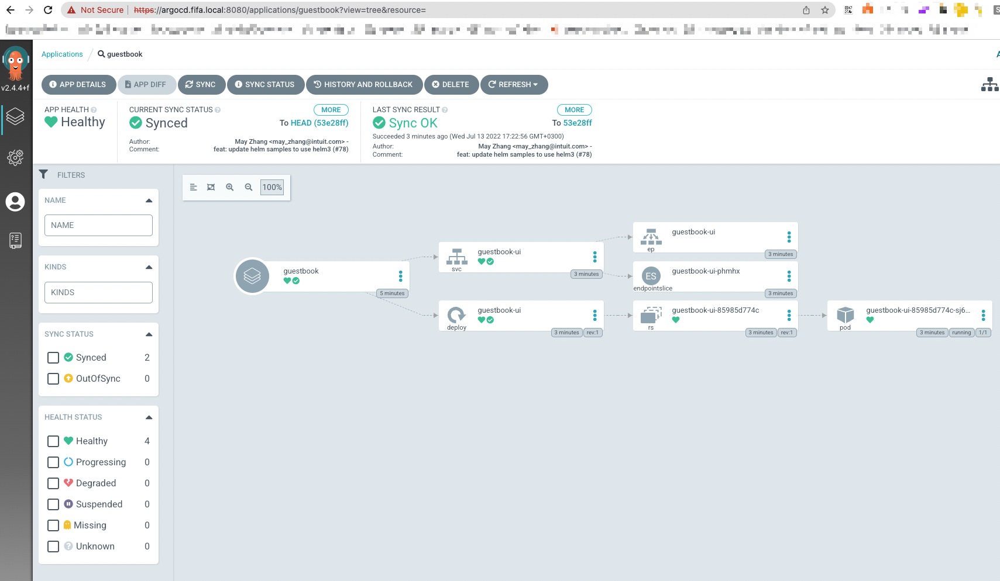

# ArgOps - WIP
```Deployment should eventually get you here - (view via LENS- https://k8slens.dev/ )```

## Terraform
````
terraform fmt
make deploy-argops
make destroy-arops
````
## Best practices to further implement if needed
````
use fixtures.us-east-2.tfvars for example var file 
create s3 state bucket
create DynamoDb lock table
add PR fmt check + plan ( set secrets from github secrets) -> approver allowes master to be auto-approved and deployed
add master\main only workflow to deploy from ( no other branch is allowed to decline state confusion) 
notification workflow (failure - git blame annotation) 
````
## Issues identified
```
error : Error syncing load balancer: failed to ensure load balancer: Multiple tagged security groups found for instance i-XXXXXXXXX
solution : modify base eks module SG attachment

error: referenced argocd module , missing context and needs modification , i have reused a different source. 
```

## Manage local certificates for development 
```
as the need to assume ssl all the way while in development , local development needs to use a custom selfsigned certificate 
being served and managed by a tool like traefik|nginx|haproxy  , WHILE the certificate will be assigned to a *.local domain 
with a /etc/hosts modification allowing all *.local to be addressed to 127.0.0.1 ( while the nginx|traefik|haproxy is loaded with the precreated cert) 
```